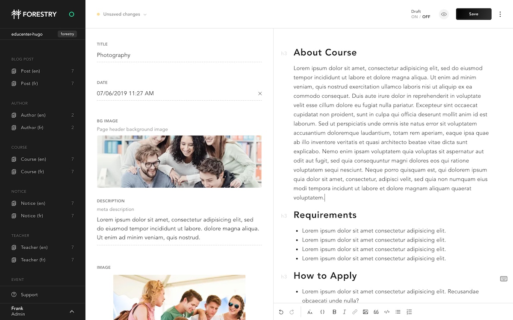

# Hugo Educenter Forestry starter

[Hugo Educenter](https://github.com/themefisher/educenter-hugo) is developed by Themefischer


[Preview](http://demo.themefisher.com/educenter-hugo/)

## Requirements

- GitHub, GitLab or BitBucket account
- Hugo > 0.62.2 (tested with 0.75.1)

## Content Management

[](https://app.forestry.io/quick-start?repo=forestryio/educenter-hugo&branch=forestry&engine=hugo&version=0.75.1)



This project is pre-configured for [Forestry](https://forestry.io) a Git-based CMS, [import it](https://app.forestry.io/quick-start?repo=forestryio/hugo-educenter-forestry&branch=forestry&engine=hugo&version=0.75.1) to edit and preview your site ✨.

## Customization

You can customize the theme through the [`config.toml` file](https://github.com/forestryio/hugo-educenter-forestry/blob/forestry/config.toml#L2-L12). Those values are accessible from within Forestry.

Any changes you make in Forestry is commited back to the repository and automatically deployed.

## Local development

```bash
# clone your imported repository
# cd in the project directory
# Start local dev server
hugo server
```

## Deployment and hosting

### Netlify

[](https://app.netlify.com/start/)

1. Connect your repository
1. Set the build command to: `hugo --gc --minify`
1. Set the publish directory to: `public`
1. Make sure to set `HUGO_VERSION` to 0.58.2 or above (tested with 0.75.1)

That's it, now your site gets deployed automatically on `git push` or when saving documents from Forestry.

## Feedback

[Open an issue](https://github.com/themefisher/educenter-hugo/issues) in the theme's repository.

## LICENSE

[CC BY 3.0](LICENSE)
